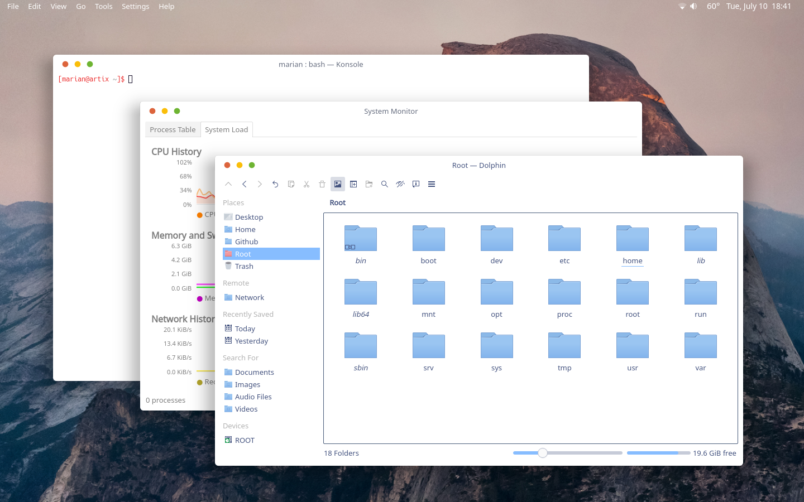

# FlatOS Window Decorations for KDE Plasma

#### Tested with Plasma 5.x

This is a high contrast version of my theme Flat OSX for the KDE desktop environment. If this is too much contrast for you check out [Breeze OSX](https://www.opendesktop.org/p/1159008). The default border width (config settings set to "normal") is 8px. This is intentional. It makes for a consistent design throughout any application. All buttons got subtle indicators for their actions just like the recent OSX/macOS versions do, only a little less dominant/irritating.

### Installation

Go to `System Settings > Application Style > Window Decorations > Get New Decorations...` and search for `Flat`

### Manually

Go to [openDesktop.org](https://www.opendesktop.org/p/1199822) and download the compressed theme folder. Then extract it (change download path if necessary):
```
$ tar -xzvf ~/Downloads/Flat-OSX.tar.gz -C ~/.local/share/aurorae/themes
```
This will extract all necessary files to its location. After that go to the system configurations mentioned and just select the new theme.

### How to tweak

If you would like to lower the border value you can easily change the [layout] section of Flat-OSXrc namely the values of BorderBottom, BorderLeft and BorderRight. If you would like to use this theme without borders set the config settings to "tiny".

# Enjoy!

### License

This project is licensed under the CC-BY-NC-SA - see the [LICENSE](LICENSE.md) file for details

### Coffee
In the past years I have spent quite some hours on open source projects. If you are the type of person who digs attention to detail, know how much work is involved in it and/or simply likes to support makers with a coffee or a beer I would greatly appreciate your donation on my [PayPayl](https://www.paypal.me/marianarlt) account.